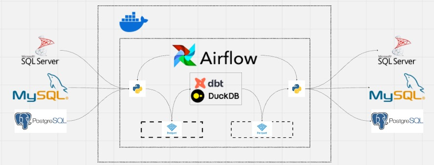

## ⚙️ Modern Data Flow Architecture

This project leverages a modern data stack to achieve efficient, scalable, and maintainable data pipelines. Below is an overview of how **Airflow**, **DuckDB**, and **dbt** work together within the architecture:

### 🏗 Architecture Overview

1. **Data Ingestion**:
   - Sources: Data is ingested from **Microsoft SQL Server**, **MySQL**, and **PostgreSQL**.
   - Orchestration: Airflow orchestrates the data ingestion process, scheduling and monitoring tasks.

2. **In-Memory Data Processing**:
   - **DuckDB**: Acts as a lightweight, high-performance in-memory database for data transformations, enabling faster execution compared to traditional relational databases.

3. **Transformations with dbt**:
   - **dbt (Data Build Tool)**: Used to define and manage transformations using SQL models. dbt integrates seamlessly with DuckDB, making it easy to transform raw data into analytics-ready datasets.

4. **Orchestration with Airflow**:
   - Airflow manages dependencies, schedules workflows, and ensures retries in case of failures.
   - Each step of the pipeline, from ingestion to transformation, is logged and monitored via Airflow’s dashboard.

5. **Data Export**:
   - Processed and transformed data is loaded back into **Microsoft SQL Server**, **MySQL**, and **PostgreSQL**, ready for analytics or further processing.

---

### 🖼 Visualizing the Architecture

Here’s a high-level diagram of the data flow:

---

### 🚀 Why this Modern Stack?

- **Airflow**: Orchestrates complex workflows with ease, ensuring scalability and fault tolerance.
- **DuckDB**: Optimized for in-memory operations, it provides lightning-fast data processing.
- **dbt**: Simplifies transformations with modular, testable, and version-controlled SQL models.

This combination outperforms traditional ETL approaches by providing:
- Faster execution times.
- Easier maintainability.
- Greater flexibility for handling modern data challenges.

---

## 🏆 Benchmark: Airflow + DuckDB + dbt vs. SSIS

To evaluate the performance of this modern stack, we conducted a benchmark comparing it to **SQL Server Integration Services (SSIS)**. Below are the results:

| **Tool**          | **Execution Time** | **Scalability**      | **Failure Handling**         | **Resource Utilization**    |
|--------------------|--------------------|-----------------------|-------------------------------|-----------------------------|
| **SSIS**          | Failed to process 100,000 rows in a reasonable time. | Low | Manual intervention required for failure recovery. | High memory and CPU usage. |
| **Airflow + DuckDB + dbt** | **6 minutes** | High (supports horizontal scaling with distributed workers) | Automated retries and alerts. | Optimized resource usage with in-memory processing. |

### Key Insights:
1. **Performance**: The modern stack is significantly faster due to DuckDB’s in-memory processing capabilities.
2. **Flexibility**: dbt’s modular SQL transformations allow for better manageability and easier debugging.
3. **Reliability**: Airflow ensures workflow dependencies and automates failure recovery, reducing manual intervention.

---

### 🌟 Conclusion

By integrating **Airflow**, **DuckDB**, and **dbt** into your data stack, you achieve:
- **Faster processing times** compared to legacy tools like SSIS.
- **Improved reliability** through modern orchestration.
- **Enhanced flexibility** to handle complex data workflows.

Ready to explore this cutting-edge stack? Clone the repository and get started today!
